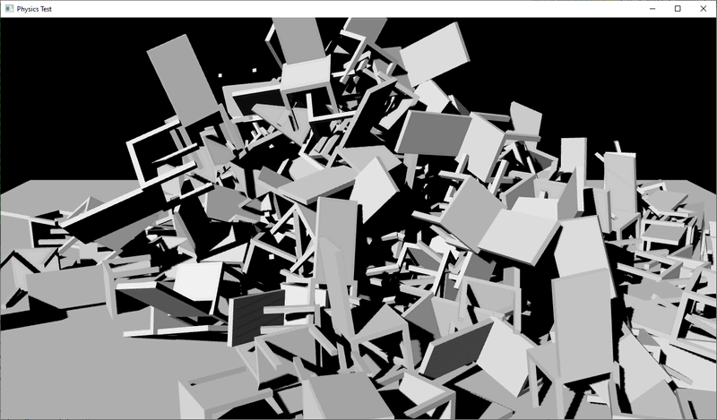
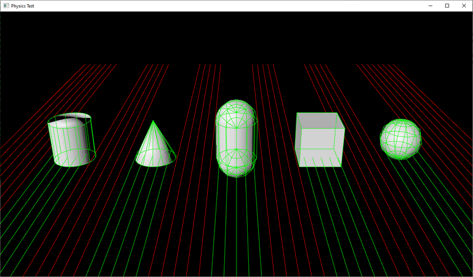

# HARFANG Physics QA tests

A series of test, implemented in Lua, for QA'ing the integration of [Bullet Physics](https://github.com/bulletphysics) into HARFANG.
Each `.lua` unit as a specific purpose. The list below is meant to set an overall roadmap of the topics to be tested:

## Collision shapes

- check dimensions, matching ScenePhysicDebug with specified dimensions
  - quick visual check with HG Studio is welcome
- check transformations
- correct handling of multi shape (eg. chair with multiple box coll)

## Body types (cube, sphere, cylinder...)

- static
  - no reaction to forces (gravity, force, impulse, collisions)
  - cannot be moved

- kinematic
  - no reaction to forces (gravity, force, impulse, collisions)
  - movable in code
    - get() new coordinates?

  - kinematic parenting must work
    - via instantiation
    - via animation

- dynamic
  - reaction to forces (gravity, force, impulse, torque, collisions)

- interaction between types
  - static/kinematic interaction
    - collision event should be raised! (e.g. implement a character controller by hand)
  - kinematic/dynamic interaction (moving platform with a cube/sphere/cone on it)
    - check collision event
  - dynamic/dynamic interaction

## Raycast
- Press the `R` key to casts 4 raycasts offseted on X and Y view space and displays in 3d the intersection points (white ray to the intersection point or red if no intersection)
	
## Collision event
- display the number of collisions in the frame
- provide visual output (ScenePhysicDebug probably)

## Restitution
- ground plane with 10 cubes bouncing from a pre-defined height (0, 0.1, 0.2, 0.3, etc...)

## Friction
- ground plane with 10 sliding cubes (0, 0.1, 0.2, 0.3, etc.)

## Addition/removal of physical elements
 - `TODO`

